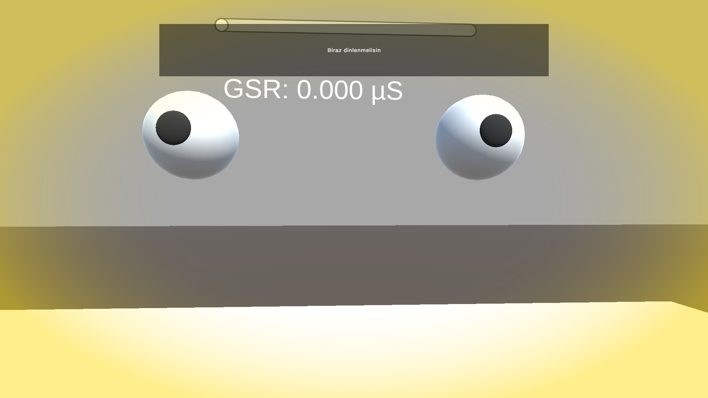
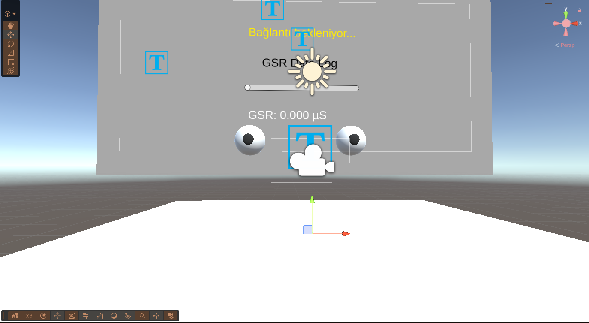
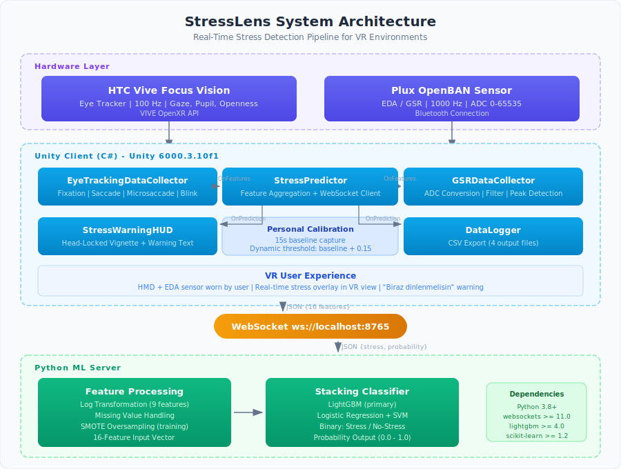
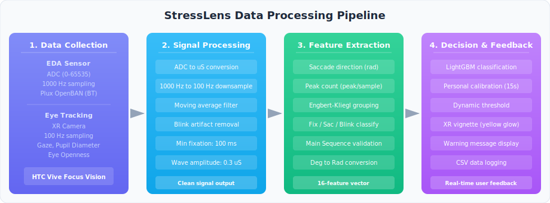
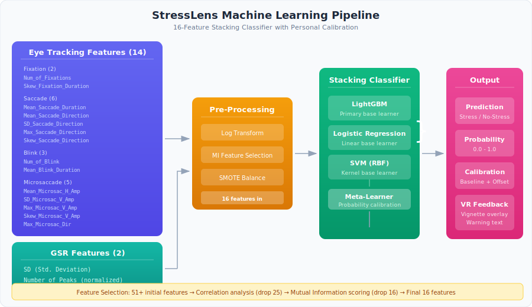
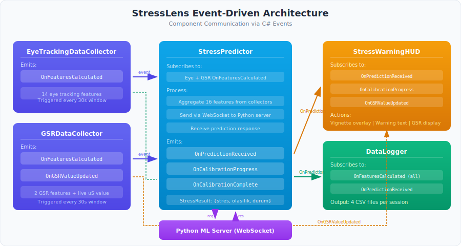

# StressLens
## REAL-TIME STRESS DETECTION AND MONITORING PLATFORM IN VIRTUAL REALITY

StressLens is a real-time physiological stress detection system developed by Lider Teknoloji Gelistirme Ltd. Sti. for Virtual Reality (VR) environments. It combines biometric data from eye tracking and electrodermal activity (EDA/GSR) sensors with machine learning to provide immediate, non-invasive stress feedback to users during VR sessions. The platform is built on Unity and targets the HTC Vive Focus Vision headset.




## Software Description

StressLens provides a complete end-to-end stress monitoring pipeline, from raw sensor acquisition to real-time visual feedback inside VR. The platform supports:

- Real-time eye tracking data collection via HTC VIVE OpenXR API (100 Hz)
- Electrodermal activity (EDA/GSR) measurement via Plux OpenBAN biosensor (1000 Hz)
- Signal processing with moving average filtering and blink artifact removal
- Automated feature extraction (16 features from 5 physiological categories)
- LightGBM-based binary stress classification with personal calibration
- Head-locked VR HUD with vignette warning overlay and live status display
- Persistent CSV data logging for offline analysis
- WebSocket-based real-time communication between Unity client and Python ML server

## Technical Features

**Built with Unity 6**: StressLens is built on Unity 6000.3.10f1, leveraging its advanced XR rendering pipeline and native OpenXR support for optimal VR performance.

**Eye Tracking via VIVE OpenXR**: Utilizes the HTC Vive Focus Vision's built-in eye tracker through the VIVE OpenXR Plugin. Captures gaze position, pupil diameter, and eye openness at 100 Hz, enabling detection of fixations, saccades, microsaccades, and blinks with scientific validation (Engbert-Kliegl algorithm, Main Sequence correlation).

**Electrodermal Activity Sensing**: Interfaces with the Plux OpenBAN device via Bluetooth for high-frequency (1000 Hz) galvanic skin response measurement. Implements wave detection algorithms to identify stress-response peaks with configurable amplitude thresholds.

**Machine Learning Stress Classification**: Employs a LightGBM-based stacking classifier (LightGBM + Logistic Regression + SVM) trained on the VREED dataset. Features are selected through Mutual Information scoring and correlation analysis, reducing the original 51+ features to an optimal set of 16.

**Personal Calibration System**: Each session begins with a 15-30 second calibration period to establish a user-specific baseline. Dynamic thresholds are computed as baseline + offset, bounded by configurable min/max limits, ensuring accurate stress detection across individual differences.

**Immersive VR Feedback**: Stress warnings are delivered through a head-locked HUD with a radial vignette overlay (yellow tint) and text message. The system provides smooth fade transitions, calibration progress tracking, and optional live GSR/prediction display, all designed for VR ergonomics.

**Event-Driven Architecture**: Components communicate through C# events, enabling loose coupling between data collectors, the stress predictor, the HUD, and the data logger. This modular design allows independent development and testing of each component.

**WebSocket Real-Time Communication**: The Unity client communicates with the Python ML server via WebSocket (ws://localhost:8765), enabling low-latency prediction requests with automatic reconnection and exponential backoff.

---

## System Architecture



### Architecture Overview

StressLens follows an event-driven architecture with clear separation between data acquisition, processing, prediction, and visualization layers:

```
                     ┌─────────────────────────────────────────────┐
                     │              Unity Client (C#)              │
                     │                                             │
  ┌──────────────┐   │  ┌─────────────────┐  ┌─────────────────┐  │
  │  HTC Vive    │───│─>│ EyeTrackingData │  │  GSRDataCollec  │<─│───┐
  │ Focus Vision │   │  │   Collector     │  │      tor        │  │   │
  │ (Eye Track.) │   │  └───────┬─────────┘  └───────┬─────────┘  │   │  ┌──────────┐
  └──────────────┘   │          │ OnFeatures         │ OnFeatures  │   │  │   Plux   │
                     │          │ Calculated         │ Calculated  │   └──│ OpenBAN  │
                     │          v                    v             │      │(EDA/GSR) │
                     │  ┌─────────────────────────────────────┐   │      └──────────┘
                     │  │         StressPredictor              │   │
                     │  │  (Feature aggregation + WebSocket)   │   │
                     │  └──────┬──────────────────┬────────────┘   │
                     │         │                  │                │
                     │         │ OnPrediction     │ WebSocket      │
                     │         │ Received         │ JSON           │
                     │         v                  v                │
                     │  ┌──────────────┐  ┌──────────────────┐    │
                     │  │StressWarning │  │   DataLogger     │    │
                     │  │    HUD       │  │  (CSV logging)   │    │
                     │  └──────────────┘  └──────────────────┘    │
                     └────────────────────┬────────────────────────┘
                                          │ WebSocket
                                          v
                     ┌─────────────────────────────────────────────┐
                     │          Python ML Server                    │
                     │                                             │
                     │  ┌──────────────┐  ┌─────────────────────┐ │
                     │  │   Feature    │  │  LightGBM Stacking  │ │
                     │  │  Processing  │─>│    Classifier       │ │
                     │  │(log transf.) │  │ (LightGBM+LR+SVM)  │ │
                     │  └──────────────┘  └─────────────────────┘ │
                     │                                             │
                     │  Calibration Engine (per-client baseline)   │
                     └─────────────────────────────────────────────┘
```

### Key System Components

| Component | Responsibility | Technology |
|-----------|---------------|------------|
| **EyeTrackingDataCollector** | Gaze data acquisition and eye movement classification | VIVE OpenXR Eye Tracker API |
| **GSRDataCollector** | EDA signal acquisition, filtering, and peak detection | Plux OpenBAN via Bluetooth |
| **StressPredictor** | Feature aggregation, WebSocket communication, prediction dispatch | System.Net.WebSockets |
| **StressWarningHUD** | Head-locked VR overlay with vignette warning and status display | Unity UI + TextMeshPro |
| **DataLogger** | Persistent CSV logging of raw data, features, and predictions | System.IO |
| **WebSocket Server** | ML inference, log transformation, personal calibration | Python + LightGBM |

---

## Data Processing Pipeline




---

## Data Collection

### Eye Tracking (EyeTrackingDataCollector)

Captures real-time gaze data from the HTC Vive Focus Vision at 100 Hz using the VIVE OpenXR Eye Tracker API. Per-eye data includes position, orientation, pupil diameter, and eye openness.

**Eye Movement Classification:**

| Movement Type | Detection Method | Threshold |
|--------------|-----------------|-----------|
| Fixation | Velocity below threshold | < 30 deg/s |
| Saccade | Velocity above threshold | > 50 deg/s |
| Microsaccade | Saccade with small amplitude | < 1.0 deg amplitude |
| Blink | Eye openness below threshold | < 0.1 openness |

**Validation Systems:**
- **Main Sequence Validation**: Pearson correlation between saccade amplitude and peak velocity (biological plausibility check)
- **Engbert-Kliegl Algorithm**: Velocity-based microsaccade detection with adaptive thresholds (30-200 deg/s)
- **Blink Protection**: Data samples during detected blinks are excluded from analysis to prevent artifacts

**Extracted Features (14 eye tracking features):**

| Category | Features | Count |
|----------|----------|-------|
| Fixation | Num_of_Fixations, Skew_Fixation_Duration | 2 |
| Saccade | Mean/Skew_Saccade_Duration, Mean/SD/Max_Saccade_Direction, Skew_Saccade_Amplitude | 6 |
| Blink | Num_of_Blink, Mean/Skew_Blink_Duration | 3 |
| Microsaccade | Mean_Microsac_H_Amp, SD/Max/Skew_Microsac_V_Amp, Max_Microsac_Dir | 5* |

*\*Some microsaccade features overlap with saccade category after MI selection.*

### Electrodermal Activity (GSRDataCollector)

Interfaces with the Plux OpenBAN biosensor via Bluetooth for high-frequency EDA measurement.

**Signal Processing Pipeline:**
1. **ADC Conversion**: Raw ADC values (0-65535) converted to microsiemens: `EDA(µS) = ADC / 2^n × VCC / 0.12`
2. **Downsampling**: 1000 Hz → normalized to training data rate (100 Hz equivalent)
3. **Moving Average Filter**: Configurable window size (default: 10 samples) for noise reduction
4. **Wave Detection**: Rise-peak-decay pattern identification with configurable thresholds (minimum amplitude: 0.3 µS)

**Extracted Features (2 GSR features):**

| Feature | Description |
|---------|-------------|
| SD | Standard deviation of EDA signal in time window |
| Number of Peaks | Stress-response peak count normalized by sample count |

---

## Machine Learning Pipeline



### Feature Selection

The model uses 16 features selected from an initial pool of 51+ through a two-stage process:

1. **Correlation Analysis**: Highly correlated features (25 features) are dropped to reduce redundancy
2. **Mutual Information Scoring**: Remaining features ranked by information gain; bottom 16 dropped

### Model Architecture

```
Input (16 raw features)
    │
    ├── Log Transformation (server-side, 9 features)
    │
    ├── LightGBM ─────────────┐
    ├── Logistic Regression ──┼── Stacking Meta-Learner
    └── SVM (RBF kernel) ─────┘
                                    │
                              Stress Probability (0-1)
                                    │
                              Personal Calibration
                              (baseline + offset)
                                    │
                              Binary Decision
                              (Stressed / Not Stressed)
```

### Feature List (v3 Model)

| # | Feature Name | Source | Description |
|---|-------------|--------|-------------|
| 1 | Number of Peaks | GSR | Normalized stress-response peak count |
| 2 | SD | GSR | Standard deviation of EDA signal |
| 3 | Num_of_Fixations | Eye | Fixation count rate |
| 4 | Skew_Fixation_Duration | Eye | Skewness of fixation durations |
| 5 | Mean_Saccade_Duration | Eye | Average saccade duration |
| 6 | Skew_Saccade_Direction | Eye | Skewness of saccade directions |
| 7 | Mean_Saccade_Direction | Eye | Average saccade direction (radians) |
| 8 | SD_Saccade_Direction | Eye | Std. deviation of saccade directions |
| 9 | Max_Saccade_Direction | Eye | Maximum saccade direction |
| 10 | Num_of_Blink | Eye | Blink frequency |
| 11 | Mean_Blink_Duration | Eye | Average blink duration |
| 12 | Mean_Microsac_H_Amp | Eye | Mean horizontal microsaccade amplitude |
| 13 | SD_Microsac_V_Amp | Eye | Std. deviation of vertical microsaccade amplitude |
| 14 | Max_Microsac_V_Amp | Eye | Maximum vertical microsaccade amplitude |
| 15 | Skew_Microsac_V_Amp | Eye | Skewness of vertical microsaccade amplitude |
| 16 | Max_Microsac_Dir | Eye | Maximum microsaccade direction |

### Personal Calibration

The WebSocket server implements per-client calibration to account for individual physiological differences:

| Parameter | Default Value | Description |
|-----------|--------------|-------------|
| Calibration Duration | 15 seconds | Initial baseline measurement period |
| Stress Offset | 0.15 | Added to baseline for threshold |
| Min Threshold | 0.25 | Lower bound for dynamic threshold |
| Max Threshold | 0.60 | Upper bound for dynamic threshold |
| Default Threshold | 0.50 | Used before calibration completes |

---

## VR User Interface

### Stress Warning HUD (StressWarningHUD)

The HUD is a head-locked World Space Canvas that follows the user's camera, providing non-intrusive feedback:

**Design Principles (VR Ergonomics):**
- Stress warning centered; all other information in lower region to avoid blocking central vision
- Semi-transparent background with appropriately sized text for peripheral visibility
- Calibration panel auto-hides after completion to reduce visual clutter
- Smooth fade transitions to prevent jarring visual changes

| HUD Component | Position | Function |
|--------------|----------|----------|
| Vignette Overlay | Full screen | Yellow-tinted radial gradient when stressed |
| Warning Text | Center-top | "Biraz dinlenmelisin" message |
| Calibration Status | Bottom panel | Progress bar + elapsed/total time |
| GSR Value | Bottom-left (optional) | Live µS reading with color coding |
| Prediction Text | Bottom-center | "Normal %77" / "Stresli %85" |

### Data Correction & Normalization


Key corrections applied to ensure training-data compatibility:

| Correction | Before | After |
|-----------|--------|-------|
| Saccade Direction | Degrees (179.86°) | Radians (3.14 rad) |
| Peak Normalization | peak/time_window (0.033) | peak/sample_count (3.33×10⁻⁵) |
| Microsaccade Detection | Per-frame counting (inflated 2-3x) | Engbert-Kliegl event grouping |
| Blink Protection | Blink artifacts included | Blink samples excluded from analysis |

---

## WebSocket Communication

### Protocol

The Unity client and Python server communicate via WebSocket at `ws://localhost:8765`.

**Request (Unity → Python):**
```json
{
  "Number of Peaks": 15.0,
  "SD_Saccade_Direction": 15.2,
  "Mean_Blink_Duration": 150.0,
  "Num_of_Blink": 12.5,
  "Max_Microsac_Dir": 110.0,
  "Max_Saccade_Direction": 120.0,
  "Num_of_Fixations": 45.2,
  "Mean_Saccade_Direction": 90.0,
  "Mean_Saccade_Duration": 45.3,
  "SD": 1.8,
  "Max_Microsac_V_Amp": 2.5,
  "Skew_Fixation_Duration": 0.8,
  "Mean_Microsac_H_Amp": 1.5,
  "SD_Microsac_V_Amp": 0.8,
  "Skew_Microsac_V_Amp": 0.15,
  "Skew_Saccade_Direction": 1.2
}
```

**Response (Python → Unity):**
```json
{
  "stres": 1,
  "stres_olasilik": 0.85,
  "stres_yok_olasilik": 0.15,
  "durum": "stresli",
  "basari": true
}
```

**Calibration Response (during calibration period):**
```json
{
  "stres": 0,
  "stres_olasilik": 0.42,
  "stres_yok_olasilik": 0.58,
  "durum": "kalibrasyon",
  "basari": true,
  "calibration_progress": 10.0,
  "calibration_total": 15.0,
  "is_calibrated": false,
  "baseline": 0.0,
  "threshold": 0.50
}
```

---

## Installation

### Prerequisites

- Unity 6000.3.10f1 or later
- Python 3.8+
- HTC Vive Focus Vision headset (for eye tracking)
- Plux OpenBAN device (for EDA/GSR measurement)
- Windows 10 or later

### 1. Clone the Repository

```bash
git clone https://github.com/LiderTeknolojiGelistirme/STRESSLENS.git
```

### 2. Unity Client Setup

1. Open the project in Unity Hub (Unity 6000.3.10f1).
2. Required packages are defined in `Packages/manifest.json` and will install automatically:
   - XR Interaction Toolkit (3.3.1)
   - XR Hands (1.7.3)
   - OpenXR Plugin (1.12.1)
   - VIVE OpenXR Plugin
   - AR Foundation (6.3.3)
   - Post Processing (3.4.0)
   - TextMesh Pro
3. Open `Assets/Scenes/DemoScene.unity` as the main scene.
4. Configure XR settings for your target device.

### 3. Python ML Server Setup

```bash
cd VREED

# Install dependencies
pip install -r requirements_ws.txt

# Train and save the model (first time only)
python save_model.py

# Start the WebSocket server
python websocket_server.py
```

The server will start listening on `ws://localhost:8765`.

### 4. Hardware Setup

1. **HTC Vive Focus Vision**: Enable eye tracking in device settings. Ensure the VIVE OpenXR runtime is active.
2. **Plux OpenBAN**: Pair via Bluetooth. Attach EDA electrodes to the participant's non-dominant hand (index and middle finger).

---

## Usage

1. Start the Python WebSocket server (`python websocket_server.py`).
2. Launch the Unity project and enter Play mode (or deploy to headset).
3. Put on the VR headset and the EDA electrodes.
4. **Calibration Phase** (first 15 seconds): Remain calm. The system establishes your personal baseline.
5. **Monitoring Phase**: The system continuously monitors stress. When stress is detected:
   - A yellow vignette overlay appears around the screen edges
   - "Biraz dinlenmelisin" (Take a rest) message is displayed
   - Stress probability is shown in the bottom panel
6. Data is automatically logged to CSV files in the application's persistent data path.

### Test Mode

For development and demonstration without hardware:

1. On the `StressWarningHUD` component, enable **Test Mode**.
2. The system will simulate calibration followed by alternating stress/normal states.
3. Configure the test interval (2-15 seconds) to control state switching speed.

---

## Project Structure

```
STRESSLENS/
├── Assets/
│   ├── Scripts/                          # Core application code
│   │   ├── EyeTrackingDataCollector.cs   # Eye tracking acquisition & feature extraction
│   │   ├── GSRDataCollector.cs           # EDA/GSR acquisition & feature extraction
│   │   ├── StressWarningHUD.cs           # VR stress warning interface
│   │   ├── HUDController.cs              # Post-processing vignette effects
│   │   ├── DataLogger.cs                 # CSV data persistence
│   │   ├── CalibrationUI.cs              # Calibration workflow UI
│   │   ├── PassthroughManager.cs         # AR passthrough handling
│   │   ├── GSRDisplayUI.cs               # GSR value display component
│   │   ├── PluxDeviceManager/            # Plux biosensor integration
│   │   │   ├── PluxDeviceManager.cs      # Device communication manager
│   │   │   └── utils/                    # Threading and channel utilities
│   │   └── ...
│   ├── Scenes/
│   │   └── DemoScene.unity               # Main demonstration scene
│   ├── Screenshots/                      # Application screenshots
│   ├── Prefabs/                          # Reusable Unity prefabs
│   ├── Resources/                        # Runtime-loaded assets
│   ├── Samples/                          # XR plugin sample implementations
│   ├── XR/                               # XR configuration and settings
│   └── DemoKayitlari/                    # Sample user recordings (8 sessions)
│
├── VREED/                                # Python ML Backend
│   ├── websocket_server.py               # WebSocket prediction server with calibration
│   ├── save_model.py                     # Model training and serialization
│   ├── VREED.ipynb                       # Jupyter notebook for model development
│   ├── test_websocket.py                 # Server testing script
│   ├── model/
│   │   ├── lightgbm_model.pkl            # Trained LightGBM stacking model
│   │   ├── calibrated_model.pkl          # Probability-calibrated variant
│   │   ├── feature_columns.json          # 16 selected feature names
│   │   └── model_meta.json              # Log transforms, thresholds, metadata
│   ├── EyeTracking_FeaturesExtracted.csv # Eye tracking training data
│   ├── GSR_FeaturesExtracted.csv         # EDA training data
│   ├── requirements.txt                  # Notebook dependencies
│   └── requirements_ws.txt               # Server dependencies
│
├── bildiri_sekiller/                     # Publication figures
│   ├── sekil_pipeline.png                # Data processing pipeline diagram
│   └── sekil_oncesi_sonrasi.png          # Feature correction comparison
│
├── drift_plots/                          # Feature drift analysis plots (32 features)
├── ProjectSettings/                      # Unity project configuration
├── Packages/                             # Unity package manifest
├── StressLens.sln                        # Visual Studio solution
├── LICENSE                               # Apache 2.0
└── README.md
```

---

## Core Unity Packages

| Package | Version | Purpose |
|---------|---------|---------|
| XR Interaction Toolkit | 3.3.1 | Standardized XR interaction framework |
| XR Hands | 1.7.3 | Hand tracking support |
| OpenXR Plugin | 1.12.1 | Cross-platform XR device abstraction |
| VIVE OpenXR Plugin | latest | HTC Vive-specific XR features and eye tracking API |
| AR Foundation | 6.3.3 | AR/MR capabilities and passthrough |
| Post Processing | 3.4.0 | Visual effects (vignette overlay) |
| TextMesh Pro | - | High-quality text rendering for VR UI |

## Python Dependencies

| Package | Version | Purpose |
|---------|---------|---------|
| websockets | >= 11.0 | WebSocket server implementation |
| lightgbm | >= 4.0 | Gradient boosting classifier |
| scikit-learn | >= 1.2 | Model stacking, preprocessing, calibration |
| numpy | >= 1.23 | Numerical computation |
| pandas | >= 1.5 | Data manipulation |

---

## Event System



StressLens uses an event-driven communication pattern between its components:

| Event | Emitter | Subscribers | Trigger |
|-------|---------|------------|---------|
| `OnFeaturesCalculated` | EyeTrackingDataCollector | StressPredictor, DataLogger | Eye features extracted from time window |
| `OnFeaturesCalculated` | GSRDataCollector | StressPredictor, DataLogger | GSR features extracted from time window |
| `OnGSRValueUpdated` | GSRDataCollector | StressWarningHUD | New GSR µS value received |
| `OnPredictionReceived` | StressPredictor | StressWarningHUD, DataLogger | ML server returns prediction |
| `OnCalibrationProgress` | StressPredictor | StressWarningHUD | Calibration status update |
| `OnCalibrationComplete` | StressPredictor | StressWarningHUD | Calibration finished |

---

## Data Logging

DataLogger produces four CSV output files per session:

| File | Contents | Update Rate |
|------|----------|-------------|
| `eye_tracking_raw.csv` | Raw eye tracking features (51+ columns) | Per time window |
| `eda_raw.csv` | Raw EDA features (8 columns) | Per time window |
| `model_features.csv` | 16 selected model input features | Per prediction request |
| `predictions.csv` | Model output (stress, probability, threshold) | Per prediction |

Files are saved to `Application.persistentDataPath` with session timestamps.

---

## Requirements

### Hardware

| Component | Specification | Purpose |
|-----------|--------------|---------|
| HTC Vive Focus Vision | Standalone VR headset with eye tracking | Gaze data acquisition |
| Plux OpenBAN | Bluetooth biosensor | EDA/GSR measurement |
| EDA Electrodes | Ag/AgCl, finger-mounted | Skin conductance sensing |

### Software

| Tool | Version | Purpose |
|------|---------|---------|
| Unity | 6000.3.10f1 | XR application development |
| Visual Studio | 2022+ | C# IDE |
| Python | 3.8+ | ML server runtime |
| Unity Hub | 3.x | Project management |

### Recommended Test Environment

- Clear space: approximately 2m x 2m for seated VR
- Stable Bluetooth connection for Plux device
- Local network for WebSocket communication (same machine recommended)

---

## Troubleshooting

### WebSocket Connection

- Ensure the Python server is running (`python websocket_server.py`)
- Verify port 8765 is available: `lsof -i :8765`
- Check firewall settings if running on separate machines
- The Unity client implements automatic reconnection with exponential backoff

### Model Not Found

- Run `python save_model.py` to train and save the model
- Verify `VREED/model/` directory contains `lightgbm_model.pkl` and `feature_columns.json`

### Eye Tracking Not Working

- Ensure eye tracking is enabled in HTC Vive Focus Vision settings
- Perform eye tracking calibration in the headset's system settings
- Verify the VIVE OpenXR Plugin is installed and active in Unity XR settings

### GSR/EDA Sensor Issues

- Pair the Plux OpenBAN device via Bluetooth before launching the application
- Ensure electrodes are properly attached with conductive gel
- Check `GSRDataCollector` inspector for connection status

---

## Contributing

1. Fork the repository
2. Create a feature branch (`git checkout -b feature/your-feature`)
3. Commit your changes (`git commit -m 'Add your feature'`)
4. Push to the branch (`git push origin feature/your-feature`)
5. Create a Pull Request

---

## License

This project is licensed under the Apache License 2.0 - see the [LICENSE](LICENSE) file for details.

---

## Acknowledgements

Developed by [Lider Teknoloji Gelistirme Ltd. Sti.](https://liderteknoloji.com)

Training data is based on the VREED (VR Eyes: Emotions Dataset) for physiological stress markers in virtual reality environments.
